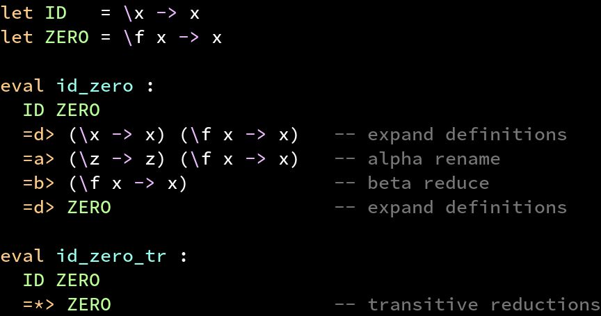

# Vim ELSA

Vim syntax highlighting and indentation for [ELSA](https://github.com/ucsd-progsys/elsa).



_Sample code taken from [ELSA's README.md](https://github.com/ucsd-progsys/elsa/blob/master/README.md)._

## Installation

You can install the syntax highlighting, indent config, and filetype detection with this Bash one-liner:

```bash
for file in after/ftplugin/elsa.vim ftdetect/elsa.vim syntax/elsa.vim; do mkdir -pv "$HOME/.vim/$(dirname "$file")"; curl "https://raw.githubusercontent.com/justinyaodu/vim-elsa/main/$file" > "$HOME/.vim/$file"; done
```

## Limitations

* Syntax highlighting assumes that definitions are uppercase and variables are lowercase
